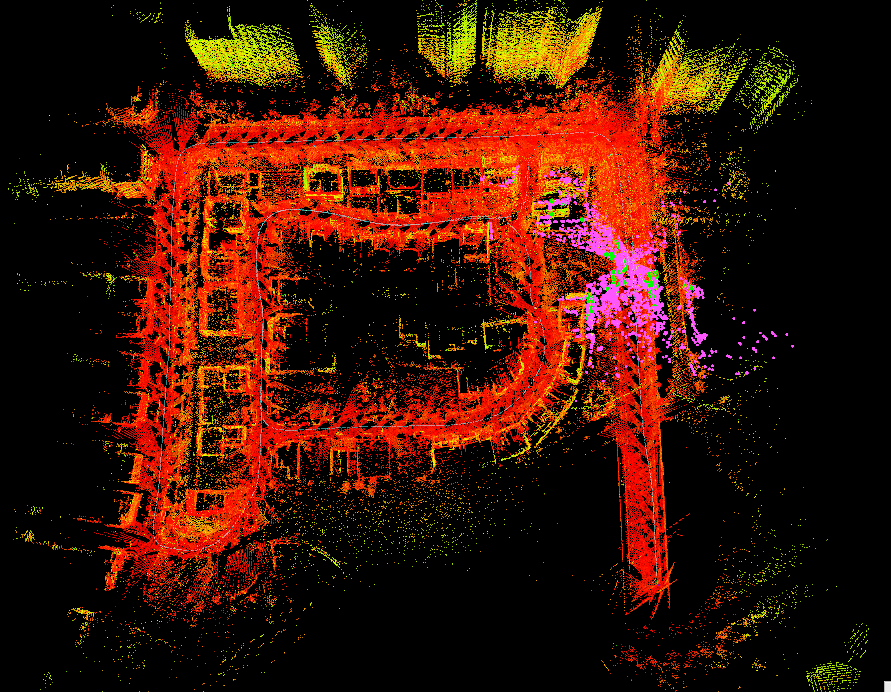
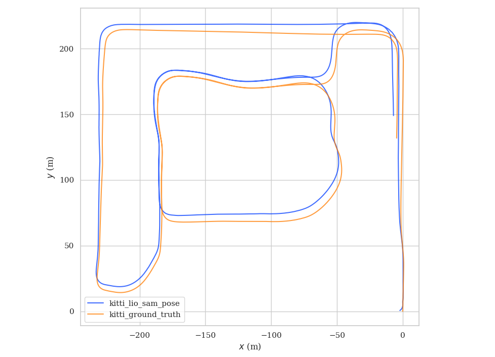
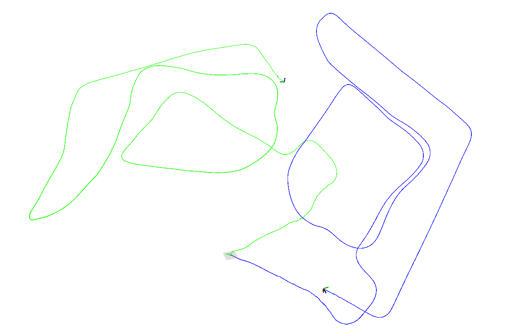

# Learning_localization_from_scratch_ws

## 项目的目的

通过自己手动实现定位相关的功能，来达到学习定位的各个算法的目的。 

文章将在 **公众号**, **CSDN**, **知乎** 三个途径进行同步更新.

 - **公众号名称**: 从零开始搭SLAM
 - **CSDN专栏地址**: [https://blog.csdn.net/tiancailx/category_11916472.html?spm=1001.2014.3001.5482](https://blog.csdn.net/tiancailx/category_11916472.html?spm=1001.2014.3001.5482)
 - **知乎专栏地址**: [https://www.zhihu.com/column/c_1530947688660631552](https://www.zhihu.com/column/c_1530947688660631552)

## 依赖库

代码是处于更新状态的，所有需要安装的依赖库都会写在 install_dependence.sh 脚本中，如果发现编译时由于依赖库报错，按照如下命令安装下依赖库即可.

```bash
cd /path_to_workspace/Learning_localization_from_scratch_ws
chmod +x install_dependence.sh
./install_dependence.sh
```

## 运行环境
- ubuntu 18.04
- ros melodic
- gtsam 4.0.2

## 测试数据
目前, 所用的数据集是Kaist数据集，其官方链接为
[Complex Urban Dataset](https://sites.google.com/view/complex-urban-dataset/download-lidar#h.sa42osfdnwst)

数据集的使用方式见：[kaist数据集体验](https://blog.csdn.net/tiancailx/article/details/125782157?spm=1001.2014.3001.5501)

我将所有的数据集汇总到一个在线表格中，地址如下
[公众号数据集汇总](https://docs.qq.com/sheet/DVElRQVNlY0tHU01I?tab=BB08J2)

## 提交代码

- 本仓库已带有clang-format文件，请在IDE中使用格式化之后再进行提交; 如不使用IDE，也可以手动使用clang-format后再提交，具体命令为
`find . -regex '.*\.\(cpp\|hpp\|c\|h\)' -exec clang-format -style=file -i {} \;`

## TODO

- [working] xx
- [done] xx
- [TODO] xx
---

以下为每篇文章对应的节点如何运行，以及对应节点的功能简介

## 基于LIO-SAM的建图

### 数据集
[Complex Urban Dataset](https://sites.google.com/view/complex-urban-dataset/download-lidar#h.sa42osfdnwst)

### 转录bag 
Kaist数据集的使用也可以通过工具将数据转成bag从而进行使用。使用的工具是kaist2bag，这个工具已经在工程的kaist_tool文件夹里了，可以直接使用。

具体的使用方法为：
- 先修改kaist2bag/config/config.yaml, 将dataset与save_to的文件夹设置好
- 执行命令 `roslaunch kaist2bag kaist2bag.launch`, 即可将每种传感器数据写成独立的bag
- 再执行命令 `rosrun kaist2bag mergebag.py merged.bag <bag_file_1> ... <bag_file_8>`, 即可将多个bag合成一个bag

### 运行
数据就使用之前转录好的bag，将bag的地址填写在 LIO-SAM/launch/run.launch 中，通过命令 `roslaunch lio_sam run.launch`, 开始建图。

### 建图效果展示



## 建图精度评估 evo(kitti/tum)

#### 第一步 将kaist的真值转成evo能够读取的格式

这一步需要安装依赖项
`pip3 install numpy scipy`
已经填写在 install_dependence.sh 文件中。

cd src/kaist_tool/kaist2bag/scripts/
python3 kaist2evo.py -p [urban_path:数据包文件夹的地址] -o [output_path:default=urban_path]

```
evo_traj kitti kitti_vrs_gps.txt kitti_lio_sam_pose.txt --ref=kitti_ground_truth.txt -p --plot_mode xy
```


启用gps约束，开始阶段关闭激光里程计约束，使用轮式里程计约束



```
roslaunch lio_sam run.launch 

evo_traj kitti kitti_ground_truth.txt kitti_lio_sam_pose.txt kitti_vrs_gps.txt -p --plot_mode xy
```

```
cd src/data
evo_traj tum tum_lio_sam_pose.txt --ref=tum_ground_truth.txt -a -p
```


### 执行评估
* 执行评估前需要先完成基于LIO-SAM的建图，建图完成后会自动生成kitti_lio_sam_pose.txt，tum_lio_sam_pose.txt，拷贝到output_path
```
evo_traj tum tum_lio_sam_pose.txt --ref=tum_ground_truth.txt -a -p
evo_traj kitti kitti_vrs_gps.txt kitti_lio_sam_pose.txt --ref=kitti_ground_truth.txt -p
```


### 代码改动
- 将左右点云转换到IMU系下并合并点云，配置文件中添加Lidar到IMU的外参
- 替换原始EKF节点，增加原始gps数据转Odometry节点，发布因子图需要的gps数据类型
- 去除原代码中ring和time字段的检查，在数据集转rosbag过程中添加此字段
- 代码中一些参数的改动，IMU频率，是否启用gps，IMU内参
- 增加轮式里程计约束，可以在配置文件中选择是否启用
- 在launch直接播放rosbag，无需手动播放rosbag 
- 可选参数配置如下

```
  # GPS Settings
  useGPS: true

  # LidarOdom Settings
  useLidarOdom: false

  # WheelOdom Settings
  useWheelOdom: true
```

## 基于点面匹配的激光里程计

#### 基本原理

代码文件在./lidar_odometry
基于点面匹配，借鉴了LIO-SAM中的匹配方式，不同的是LIO-SAM采用的是帧与附近的帧组成的局部地图匹配，本方案借鉴了A-LOAM的思想，提取面特征，先用前后两帧的面特征点构建点面残差，得到一个粗略的帧间里程计，然后将多帧累计，组成地图与当前帧匹配，修正里程计坐标系和世界坐标系之间的转换关系，得到一个更加精确的里程计。
LIO-SAM角点和平面匹配的残差构建和雅克比推导可以参考：https://zhuanlan.zhihu.com/p/548579394

#### 代码改动

- 将LIO-SAM中点面匹配部分拆分为三个节点，特征提取、scan_to_scan匹配、scan_to_map匹配

- 由于角点较少，只提取平面点，简化特征点提取条件，低于阈值即为平面点
- 采用ceres自动求导的方式，代替LIO-SAM中手动求导的方式，只需构建点面残差，省去了求雅可比的过程
- 发布scan_to_scan的里程计和scan_to_map的里程计

#### 测试效果

```
roslaunch lidar_odometry run.launch
```

