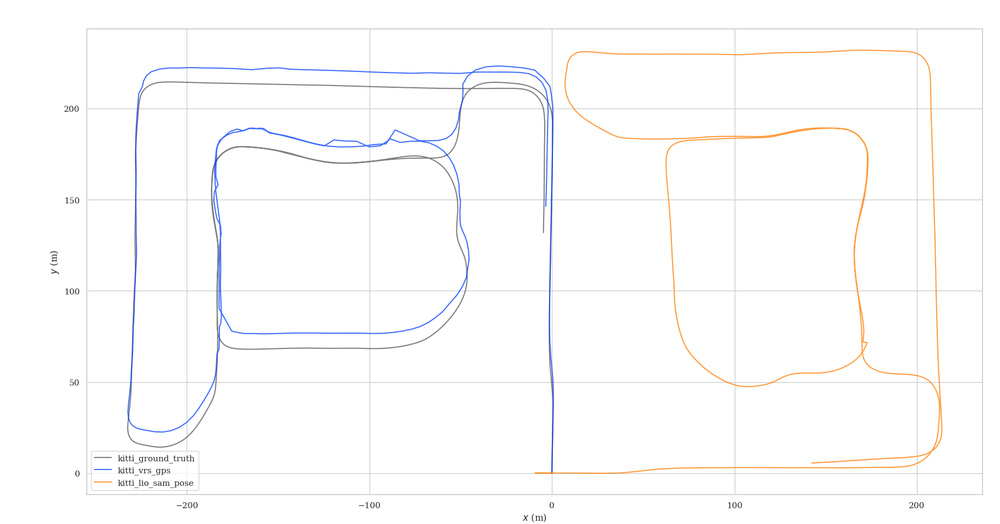

# Learning_localization_from_scratch_ws
## evo(kitti/tum)
```
mkdir src/data
cd src/kaist_tool/kaist2bag/scripts/
pip3 install -r requirements.txt
python3 kaist2evo.py
roslaunch lio_sam run.launch 
```

```
cd src/data
evo_traj tum tum_lio_sam_pose.txt --ref=tum_ground_truth.txt -a -p
```

## 基于LIO-SAM的建图

#### 数据集
[Complex Urban Dataset](https://sites.google.com/view/complex-urban-dataset/download-lidar#h.sa42osfdnwst)

本次测试采用urban08，使用方式见：https://blog.csdn.net/tiancailx/article/details/125782157?spm=1001.2014.3001.5501

#### 代码改动
- 将左右点云转换到IMU系下并合并点云，配置文件中添加Lidar到IMU的外参
- 替换原始EKF节点，增加原始gps数据转Odometry节点，发布因子图需要的gps数据类型
- 去除原代码中ring和time字段的检查，在数据集转rosbag过程中添加此字段
- 代码中一些参数的改动，IMU频率，是否启用gps，IMU内参
- 增加轮式里程计约束，可以在配置文件中选择是否启用
- 在launch直接播放rosbag，无需手动播放rosbag


#### 测试效果

```
roslaunch lio_sam run.launch
```

```
evo_traj kitti kitti_vrs_gps.txt kitti_lio_sam_pose.txt --ref=kitti_ground_truth.txt -p --plot_mode xy
```

```

  # GPS Settings
  useGPS: true

  # LidarOdom Settings
  useLidarOdom: false

  # WheelOdom Settings
  useWheelOdom: true
```

启用gps约束，开始阶段关闭激光里程计约束，使用轮式里程计约束


## 基于点面匹配的激光里程计

#### 基本原理

代码文件在./lidar_odometry
基于点面匹配，借鉴了LIO-SAM中的匹配方式，不同的是LIO-SAM采用的是帧与附近的帧组成的局部地图匹配，本方案借鉴了A-LOAM的思想，提取面特征，先用前后两帧的面特征点构建点面残差，得到一个粗略的帧间里程计，然后将多帧累计，组成地图与当前帧匹配，修正里程计坐标系和世界坐标系之间的转换关系，得到一个更加精确的里程计。
LIO-SAM角点和平面匹配的残差构建和雅克比推导可以参考：https://zhuanlan.zhihu.com/p/548579394

#### 代码改动

- 将LIO-SAM中点面匹配部分拆分为三个节点，特征提取、scan_to_scan匹配、scan_to_map匹配

- 由于角点较少，只提取平面点，简化特征点提取条件，低于阈值即为平面点
- 采用ceres自动求导的方式，代替LIO-SAM中手动求导的方式，只需构建点面残差，省去了求雅可比的过程
- 发布scan_to_scan的里程计和scan_to_map的里程计

#### 测试效果

```
roslaunch lidar_odometry run.launch
```

